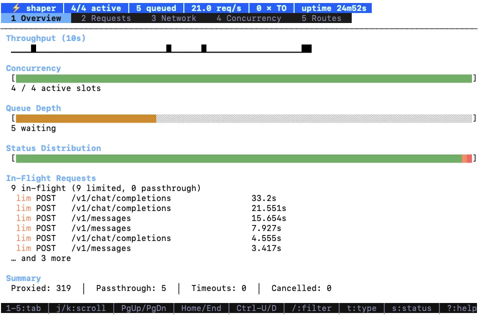

# ai-concurrency-shaper

Reverse proxy with bounded concurrency for AI/LLM API endpoints.

Sits in front of an upstream HTTP API (e.g. Anthropic, OpenAI) and limits concurrent requests to configured routes. Requests that exceed the limit block until a slot opens. No client-side backoff needed. Non-matching requests pass through unmodified.

Run with `-tui` for a terminal dashboard with live metrics and request inspection.

<p align="center">
  
</p>

## Install

```sh
go install github.com/joeycumines/ai-concurrency-shaper@latest
```

## Usage

```sh
ai-concurrency-shaper -upstream https://api.anthropic.com
```

### Flags

#### Core

| Flag | Default | Description |
|------|---------|-------------|
| `-upstream` | _(required)_ | Upstream base URL |
| `-bind` | `:8080` | Listen address |
| `-limit` | _(repeatable)_ | Route pattern to limit (defaults to common AI endpoints) |
| `-concurrency` | `4` | Max concurrent limited requests |
| `-global-concurrency` | `0` | Global concurrency limit (0 = disabled) |
| `-queue-timeout` | `30s` | Max wait for a concurrency slot |
| `-upstream-disable-keep-alives` | `false` | Disable HTTP keep-alives to upstream; each request uses a fresh TCP connection. Use when the upstream counts idle connections as concurrent. |
| `-retry` | `-1` | Max retry attempts (-1 = unlimited, 0 = disabled) |
| `-retry-max-body-mb` | `5` | Max request body size (MB) eligible for retry |
| `-tui` | `false` | Enable terminal dashboard |
| `-version` | | Print version and exit |

#### Concurrency Protection

The proxy's internal semaphore limits how many tokens are held concurrently. What the downstream actually observes depends on its own accounting: providers differ in how they measure concurrency (active connections, in-flight requests, token usage windows, etc.), and most have some lag between completing a response and decrementing their counter. These flags insert delays after slot release to reduce the risk that the downstream observes N+1 or higher concurrency, at the cost of throughput. They are configurable because the right tradeoff depends on the upstream's accounting behavior. Defaults are conservative.

| Flag | Default | Description |
|------|---------|-------------|
| `-release-cooldown` | `200ms` | Delay after releasing a slot before re-admission. Reduces the chance the next request arrives while the downstream is still cleaning up. |
| `-cancel-cooldown` | `200ms` | Hold the slot after a client disconnects once an upstream attempt has started. Mitigates N+1 from rapid connect/disconnect cycles. |
| `-failure-hold` | `2s` | Hold the slot after an upstream failure (5xx, 429, or rate-limit-signaled 403) when the circuit breaker is disabled or its penalty is zero. When the breaker is enabled with a non-zero penalty, the phantom penalty takes precedence instead. |
| `-retry-min-delay` | `1s` | Minimum delay before retrying. Reduces the chance the retry arrives before the downstream has finished accounting. |
| `-retry-skip-429` | `true` | Do not retry 429 responses. Avoids the feedback loop where retries amplify concurrency at the downstream. |
| `-adaptive-headroom` | `false` | Reduce effective concurrency by one slot after a 429, restoring after a quiet window. Use when the provider can see N+1 concurrent requests due to connection teardown or CDN accounting lag. |
| `-adaptive-headroom-window` | `30s` | How long the one-slot 429 headroom is held. Each new 429 resets this window. |

The upstream HTTP transport sizes `MaxIdleConnsPerHost` to the sum of configured route/global concurrency caps, with a per-host minimum floor of 20 applied after the global cap. This avoids closing a large burst of healthy keep-alive connections when multiple route limiters or groups share the same upstream host. Use `-upstream-disable-keep-alives` only when the upstream counts idle/open connections as concurrent.

#### Circuit Breaker

| Flag | Default | Description |
|------|---------|-------------|
| `-circuit-breaker` | `true` | Enable circuit breaker |
| `-cb-threshold` | `5` | Failures within window to trip the breaker |
| `-cb-window` | `30s` | Failure counting window |
| `-cb-open-timeout` | `10s` | Time before the breaker probes (half-open) |
| `-cb-max-open-timeout` | `120s` | Max open timeout after backoff |
| `-cb-penalty` | `2s` | Base phantom concurrency hold time |
| `-cb-max-penalty` | `60s` | Max phantom concurrency hold time |

The circuit breaker treats 5xx, 429, transport errors, and rate-limit-signaled 403s as upstream failures. A bare 403 without `Retry-After` or `x-ratelimit-*` headers is treated as an authentication/authorization client error and is passed through, avoiding the trap where a bad API key is masked by a proxy-generated 503 after the breaker opens.

#### Observability Semantics

The TUI summary separates clean completions from incomplete exchanges. `Clean proxied` and `Clean passthrough` count requests whose HTTP exchange completed through the proxy. `Aborted` counts exchanges that did not complete cleanly, including client disconnects, downstream write/flush failures, and upstream response-body copy failures; the request and network views mark those rows as aborted and leave response-complete timing unset. Status buckets still count any committed HTTP status, so an aborted stream that already received `200` appears in both the `2xx` bucket and `Aborted`.

For `101 Switching Protocols`, local inability to complete the requested upgrade (for example a non-Hijacker downstream writer or a `101` response body that is not bidirectional) and failed downstream 101 handshake write/flush are aborted HTTP exchanges, but they do not count as upstream breaker failures. Once the handshake succeeds, later WebSocket or other upgraded-protocol stream closes are treated as upgraded connection lifetime events, not HTTP response-body aborts.

#### Retry Tuning

| Flag | Default | Description |
|------|---------|-------------|
| `-retry-wait-min` | `500ms` | Minimum retry wait |
| `-retry-wait-max` | `30s` | Maximum retry wait |

### Examples

Proxy with default limits and TUI:

```sh
ai-concurrency-shaper -upstream https://api.anthropic.com -tui
```

Custom concurrency with per-route limits:

```sh
ai-concurrency-shaper \
  -upstream https://api.openai.com \
  -limit "POST /v1/chat/completions:2" \
  -limit "POST /v1/embeddings:4" \
  -global-concurrency 10
```

Grouped routes sharing a limiter:

```sh
ai-concurrency-shaper \
  -upstream https://api.anthropic.com \
  -limit "POST /v1/messages@messages:3" \
  -limit "POST /v1/messages/batches@messages:3"
```

Maximum throughput (disable all protections; only safe if the upstream has no accounting lag):

```sh
ai-concurrency-shaper \
  -upstream https://api.anthropic.com \
  -circuit-breaker=false \
  -release-cooldown 0 \
  -cancel-cooldown 0 \
  -failure-hold 0 \
  -retry-min-delay 0 \
  -retry-skip-429=false
```

### Concrete Example

Proxying to an API with strict concurrency limits, slow accounting, streaming responses, and occasional 5xx errors:

```sh
ai-concurrency-shaper \
  -upstream https://api.example.com \
  -concurrency 4 \
  -queue-timeout 30m \
  -bind 127.0.0.1:8080 \
  -tui \
  -retry 2 \
  -retry-min-delay 5s \
  -retry-skip-429=true \
  -release-cooldown 500ms \
  -cancel-cooldown 500ms \
  -circuit-breaker=true \
  -cb-threshold 2 \
  -cb-window 10s \
  -cb-penalty 5s \
  -cb-max-penalty 60s \
  -upstream-disable-keep-alives \
  -adaptive-headroom \
  -adaptive-headroom-window 30s
```

- **`-concurrency 4`** matches the upstream's per-key limit. The proxy holds at most 4 tokens concurrently.
- **`-queue-timeout 30m`** LLM streaming requests can take minutes. A 30s timeout would kill legitimate long-running requests.
- **`-retry 2`** bounded retries. More than 2 risks amplifying load during an outage; unlimited (`-1`) is only safe when the upstream recovers quickly.
- **`-retry-min-delay 5s`** the upstream has slow accounting. Without this floor, the default backoff (starting at 500ms) could send a retry before the upstream finishes cleaning up from the failed attempt.
- **`-retry-skip-429=true`** a 429 means the upstream is overloaded. Retrying adds concurrent requests and makes the problem worse.
- **`-release-cooldown 500ms`** the default 200ms is too aggressive for this upstream; accounting lag is closer to 500ms.
- **`-cancel-cooldown 500ms`** mitigates N+1 from rapid disconnect/reconnect cycles.
- **`-cb-threshold 2` / `-cb-window 10s`** trip after 2 failures in 10s. Aggressive, but appropriate when the upstream is generally reliable and any 5xx indicates a real problem. Bare 403 auth errors do not count unless the response carries rate-limit signals.
- **`-cb-penalty 5s` / `-cb-max-penalty 60s`** phantom concurrency penalty (exponential backoff). The proxy holds the slot as if a request is still in flight, reducing the rate of new requests reaching the struggling upstream. Stacks with `release-cooldown` (5s penalty, then release, then 500ms cooldown = 5.5s total).
- **`-upstream-disable-keep-alives`** the provider counts *open* connections, not just in-flight requests. Without this, idle keep-alive connections can push the observed concurrency above the `-concurrency 4` limit and trigger 429s.
- **`-adaptive-headroom` / `-adaptive-headroom-window 30s`** some providers (or their CDNs) can still observe a momentary N+1 concurrent requests because connection teardown is asynchronous. When a 429 arrives, these flags temporarily reduce the effective limit by one slot, creating headroom. The slot is restored after 30s with no new 429s.

## How Concurrency Protection Works

The proxy uses a token-bucket channel to enforce the concurrency limit. Each limited request acquires a token; the token is returned when the request completes. This bounds the proxy's internal concurrency, but the downstream may still observe more due to accounting lag (see above).

The concurrency protection flags insert dead zones between slot release and re-admission:

- **`-release-cooldown`** (success path): token is held for this duration before re-entering the pool. Default 200ms covers most provider accounting windows.
- **`-failure-hold`** (failure path): slot is held after 5xx, 429, or rate-limit-signaled 403 when the circuit breaker is disabled. Default 2s. When the breaker is enabled, the phantom penalty (`-cb-penalty`) handles failure-path holds instead — the two are mutually exclusive (else-if branches).
- **`-cancel-cooldown`** (client disconnect): slot is held briefly when a client disconnects after an upstream attempt has started. Default 200ms.
- **`-retry-min-delay`** (retry path): floor on retry delay to reduce the chance of arriving before the downstream finishes cleanup. Default 1s.
- **`-retry-skip-429`** (429 amplification): retrying a 429 adds concurrent requests at the downstream. Enabled by default.

### Stacking

Protections stack additively:

- Failure + release cooldown (breaker disabled): failure-hold (2s), then release, then release-cooldown (200ms). Total: 2.2s. Failure classification includes 5xx, 429, and rate-limit-signaled 403s; bare auth 403s are passed through.
- Failure + release cooldown (breaker enabled): phantom penalty (2 to 60s), then release, then release-cooldown (200ms). Total: penalty + 200ms. The failure-hold is not used in this path — the breaker penalty subsumes it.
- Client cancel + cancel cooldown: cancel-cooldown (200ms), then release, then release-cooldown (200ms). Total: 400ms.

## Building

```sh
make build          # compile
make test           # run tests
make lint           # vet + staticcheck + deadcode
make all            # build, then lint + test
```

## License

[GPL-3.0](LICENSE)
